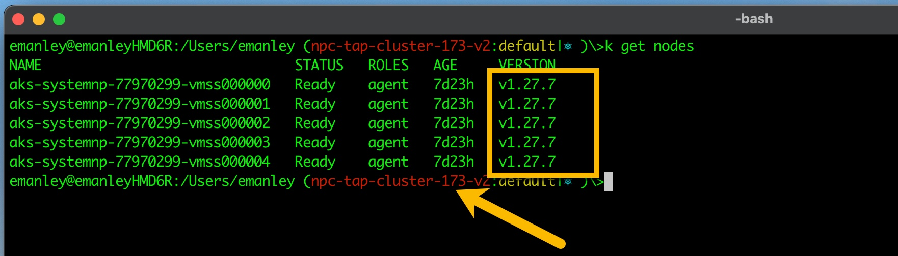

# Welcome to the tanzu-java-web-app-aks project!

This is a sample of the Tanzu Java Web App Deployed to TAP-1.7.3 on AKS, with vsCode & Tilt.


## Dependencies
| Item    | Version |
| ------- | ------------------ |
| 1. kubectl-cli | > 1.22.x |
| 2. tilt-cli | > v0.32.0 |
| 3. tanzu-cli | > v1.1.0 |
| 4. kpack/kp-cli | > 0.4.2-build.1 bef3fe1 |
| 5. TAP | > 1.7.3 |
| 6. TAP Supply Chain | - basic <br> - testing <br> - testing_scanning |
| 7. vsCode-Plugin: Tanzu Developer Tools | - 2023-10-20 |

## Notes:

| Date     | Description |
| -------- | ------- |
| 29-Feb-2024:  | - Some of my kubectl commands are aliased by 'k' <br> Ex: 'k get nodes' is 'kubectl get nodes'   |
| 23-Feb-2024:  | - Updated for TAP-1.7.3. <br> - Uses Azure-K8s: 1.27.7    |
| 20-Feb-2024:  | - Initial Implementation     |

## Setup Commands:

Login to Azure with cli:
```
az login
```

Verify correct account:
```
az account list
```

Verify correct subscription:
```
az account set --subscription ...
```

Login to target-cluster where TAP is installed:
```
az aks get-credentials --resource-group cloud-shell-storage-southcentralus --name npc-tap-cluster-173-v2
```

Verify you can see the nodes:
```
kubectl get nodes
```
Looks Like:


Docker Login to Azure ACR:
```
docker login -u cspsitigeracreast cspsitigeracreast.azurecr.io
```
## Demo Commands:

Handy commands used with tmux.

1. Watch on ALL workloads list:
```
watch tanzu app workload list -A
```

2. Watch on builder for workload [ dev1 namespace ]:
```
watch kp -n dev1 builds list tanzu-java-web-app-aks
```

3. Watch on pods for workload [ dev1 namespace ]:
```
watch kubectl -n dev1 get pods
```

4. Tail log for workload [ dev1 namespace ]:
```
tanzu -n dev1 apps workload tail tanzu-java-web-app-aks
```

5. Helpful kp commands:
```
kp -n dev1 build logs tanzu-java-web-app-aks
```
```
kp -n dev1 image trigger tanzu-java-web-app-aks
```
```
kp -n dev1 build status --bom tanzu-java-web-app-aks | jq | tee ~/data/json/tanzu-java-web-app-aks-manifest.json
```

6. curl the workload endpoint:
```
curl -Lk https://tanzu-java-web-app-aks.dev1.tap-173-v2.azure.csp-si-tiger.net/greet
```

7. curl the workload actuator:
```
curl -Lk https://tanzu-java-web-app-aks.dev1.tap-173-v2.azure.csp-si-tiger.net/actuator
```

## Demo URLs:
|Item |Link |
| -------- | ------- |
| TAP-Portal/GUI: | <http://tap-gui.tap-173-v2.azure.csp-si-tiger.net> |
| Workload Trigger: | <https://tanzu-java-web-app-aks.dev1.tap-173-v2.azure.csp-si-tiger.net/greet> |
| Workload Actuator: | <https://tanzu-java-web-app-aks.dev1.tap-173-v2.azure.csp-si-tiger.net/actuator> |
| Tilt UI: | <http://localhost:10350/r/tanzu-java-web-app-aks/overview> |


## Funny Things To Watch Out For:
| Date    | Description |
| ------- | ------------------ |
| 23-Feb-2024: | - vsCode PlugIn must be removed/reinstalled upon each vsCode Startup. |


